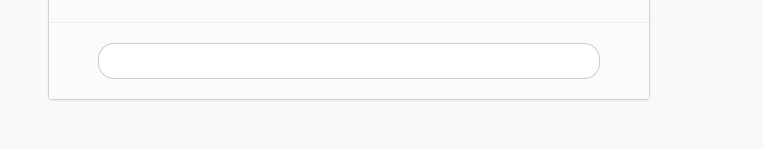
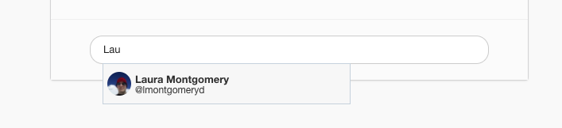
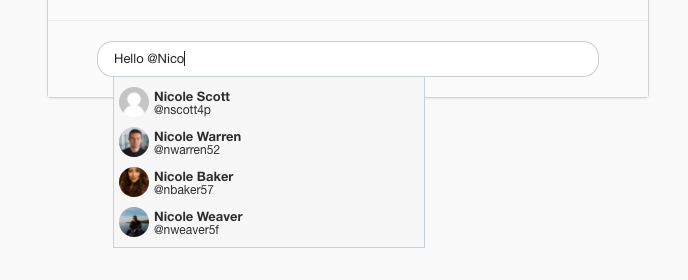

# HComment Module

Adding user mention assistance to webpages.

## Intro

`HComment` is a JavaScript module that provides assistance to the user when they try to mention someone. Such logic is implemented by major websites such as Twitter, Facebook and Instagram.

What happens is that when the user starts typing what looks to the library like a nickname or a name that is present in its database, HComment compares it to the data it has and returns a visual list of potential names for the user to choose from.

I tried to make it as modular as possible, but of course there is plenty that can be done regarding this. For instance the whole DOM could be dynamically created by the library itself so it doesn't need to be present in the HTML files.

## Logic

Based on my research, I found out that `Facebook` has to major rules for when they need to start pormpting results.

1- If the user begins the comment by a) a capital letter, and there's no other text present in the comment field.

2- When the user types `@` sign anywhere in the comment field.

In both those cases Facebook compares the result (whether be it a capital letter at the beginning of the comment field followed by other letters, of the text after an `@` sign) with the data it has.

So that is the approach I decided to take, simply because it made the most sense to me out of all the implementations, even though Twitter does only show a list of potential usernames with rule number 2.

## Code

The JavaScript code is mostly written using the ES6 specifications, and Babel is used to compile it down to JavaScript that browsers understand.

The module's code resides in `app/api/HComment.js`. Although the style of the components is in `public/style/comment.css`.

The data used as names, usernames, and avatars are in `public/data/data.json`.

We use WebPack to bundle all the code into one file `bundle.js` that is later imported with a script tag into the web page.

Code is not minified, still readable, and `devtool: '#cheap-source-map'` is added into the WebPack config file so when the browser devtools propmt an error or a log, developer can debug right through the original files `app.js` and `HComment.js` instead of the final bundle.

## Try it out

To try the demo in this nodejs app:

1. Clone/Download this repo
2. Install the dependencies with `npm install` from within the directory
3. Run `./node_modules/webpack/bin/webpack.js && node server.js`
4. Go to `http://localhost:3000`.

A shopping widget will appear and at the bottom a comment field.

Try writing `Mic` or `Hello @Nic`. For more examples check out the `data.json` file.

## Screenshots







## API Usage

The current version of the code requires adding this DOM to the HTML file first:

```html
  <div class="comment-box" id="commentBox1">
    <div class="comment" id="commentField" contenteditable="true"></div>
    <div class="mention-list" id="mentionList"></div>
  </div>
```

the id `commentBox1` can be whatever the developer desires, this is because the developer might (will?) add more than one comment box to their page (more needs to be done however on the JS side to avoid redundancies).

**Next** is creating a new instance of `HComment` and firing the `init` function.

```javascript
let comment = new HComment();
comment.init('commentBox1');
```

It is advised to wrap them in an event listener that waits for the page DOM to complete loading. So the result would be

```javascript
document.addEventListener('DOMContentLoaded', function _loaded() {
  document.removeEventListener('DOMContentLoaded', _loaded);
  let comment = new HComment();
  comment.init('commentBox1');
});
```

## Challenges

### Why `div` instead of `input`?

For starters, most implementations on the web by major websites apply username assistance to divs. And I think that by making a `div` with `contenteditable` this makes it possible for future improvements, such as applying styles to the username added, possibly parsing its full name instead to make the phrases written by the user more understandable.

### Browser compatibility

By taking the path of an editable `div`, we start to dive in browser API implementations that are either exclusive to one or two browsers, or never standardized, this makes workarounds and (dirty) hacks a must.

### Too many edge cases.

This module is obviously incomplete, mainly because of all the use cases that can't all be handled in one sitting. Example of edge cases are:

- The user types `@` but instead of writing a user name, they move the cursor behind the sign and start writing. In the program's mind the `@` has been declared, so unless a stopping condition occurs, whatever input added is to be tested against the database of names.

## What could be done better

- Making the whole module React-based/frameworkX-based for easier integration with websites that use such frameworks, and for a cleaner code.

- Testing. Functional, and Unit tests.

- Arrow keys movement through the list of results.
